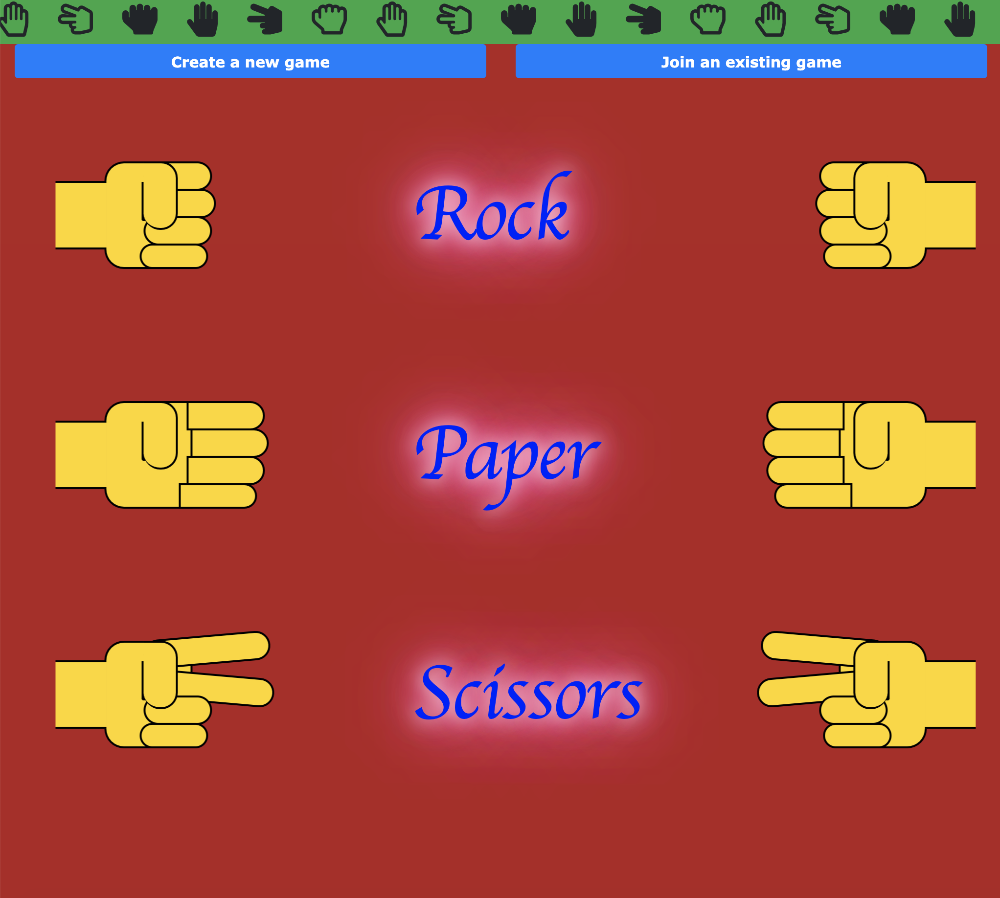

# Rock-Paper-Scissors
Rock Paper Scissors built from React (with Create React App) and Socket.IO, in which users can create and enter rooms to compete against each other in this classic multiplayer game.

TO LAUNCH THE APP IN DEVELOPMENT MODE:

* clone this repo and run 'NPM INSTALL' to install dependencies

* run 'NPM run app'

* navigate to localhost:3000 to play

TO LAUNCH THE APP IN PRODUCTION MODE:

* clone this repo and run 'NPM INSTALL' to install dependencies

* run 'NPM run deploy'

* navigate to localhost:3001 to play

TO PLAY THE GAME ONLINE:

visit https://rock-paper-scissors-brianprice.herokuapp.com/

